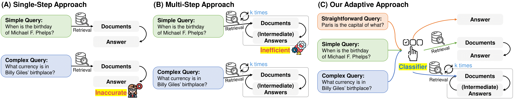

# Adaptive-RAG: Learning to Adapt Retrieval-Augmented Large Language Models through Question Complexity

Official Code Repository for the paper ["Adaptive-RAG: Learning to Adapt Retrieval-Augmented Large Language Models through Question Complexity"](https://arxiv.org/pdf/2403.14403.pdf) (NAACL 2024).

We are so grateful that our Adaptive-RAG is featured in LlamaIndex and LangChain, as follows: [LlamaIndex:Adaptive_RAG](https://github.com/mistralai/cookbook/blob/main/third_party/LlamaIndex/Adaptive_RAG.ipynb), [LangGraph:Adaptive_RAG](https://github.com/langchain-ai/langgraph/blob/main/examples/rag/langgraph_adaptive_rag_cohere.ipynb), and [ReAct:Adaptive_RAG](https://github.com/cohere-ai/notebooks/blob/main/notebooks/react_agent_adaptive_rag_cohere.ipynb)!

## Abstract

<div align="center">
  
</div>
Retrieval-Augmented Large Language Models (LLMs), which incorporate the non-parametric knowledge from external knowledge bases into LLMs, have emerged as a promising approach to enhancing response accuracy in several tasks, such as Question-Answering (QA). However, even though there are various approaches dealing with queries of different complexities, they either handle simple queries with unnecessary computational overhead or fail to adequately address complex multi-step queries; yet, not all user requests fall into only one of the simple or complex categories. In this work, we propose a novel adaptive QA framework that can dynamically select the most suitable strategy for (retrieval-augmented) LLMs from the simplest to the most sophisticated ones based on the query complexity. Also, this selection process is operationalized with a classifier, which is a smaller LM trained to predict the complexity level of incoming queries with automatically collected labels, obtained from actual predicted outcomes of models and inherent inductive biases in datasets. This approach offers a balanced strategy, seamlessly adapting between the iterative and single-step retrieval-augmented LLMs, as well as the no-retrieval methods, in response to a range of query complexities. We validate our model on a set of open-domain QA datasets, covering multiple query complexities, and show that ours enhances the overall efficiency and accuracy of QA systems, compared to relevant baselines including the adaptive retrieval approaches.

## Installation
The first step (to run our Adaptive-RAG) is to create a conda environment as follows:
```bash
$ conda create -n adaptiverag python=3.8
$ conda activate adaptiverag
$ pip install torch==1.13.1+cu117 --extra-index-url https://download.pytorch.org/whl/cu117
$ pip install -r requirements.txt
```

## Prepare Retriever Server
After installing the conda environment, you should setup the retriever server as follows:
```bash
$ wget https://artifacts.elastic.co/downloads/elasticsearch/elasticsearch-7.10.2-linux-x86_64.tar.gz
$ wget https://artifacts.elastic.co/downloads/elasticsearch/elasticsearch-7.10.2-linux-x86_64.tar.gz.sha512
$ shasum -a 512 -c elasticsearch-7.10.2-linux-x86_64.tar.gz.sha512
$ tar -xzf elasticsearch-7.10.2-linux-x86_64.tar.gz
$ cd elasticsearch-7.10.2/
$ ./bin/elasticsearch # start the server
# pkill -f elasticsearch # to stop the server
```

Start the elasticsearch server on port 9200 (default), and then start the retriever server as shown below.
```bash
uvicorn serve:app --port 8000 --app-dir retriever_server
```


## Datasets
* You can download multi-hop datasets (MuSiQue, HotpotQA, and 2WikiMultiHopQA) from https://github.com/StonyBrookNLP/ircot.
```bash
# Download the preprocessed datasets for the test set.
$ bash ./download/processed_data.sh
# Prepare the dev set, which will be used for training our query complexity classfier.
$ bash ./download/raw_data.sh
$ python processing_scripts/subsample_dataset_and_remap_paras.py musique dev_diff_size 500
$ python processing_scripts/subsample_dataset_and_remap_paras.py hotpotqa dev_diff_size 500
$ python processing_scripts/subsample_dataset_and_remap_paras.py 2wikimultihopqa dev_diff_size 500

# Build index
python retriever_server/build_index.py {dataset_name} # hotpotqa, 2wikimultihopqa, musique
```

* You can download single-hop datasets (Natural Question, TriviaQA, and SQuAD) from https://github.com/facebookresearch/DPR/blob/main/dpr/data/download_data.py.
```bash
# Download Natural Question
$ mkdir -p raw_data/nq
$ cd raw_data/nq
$ wget https://dl.fbaipublicfiles.com/dpr/data/retriever/biencoder-nq-dev.json.gz
$ gzip -d biencoder-nq-dev.json.gz
$ wget https://dl.fbaipublicfiles.com/dpr/data/retriever/biencoder-nq-train.json.gz
$ gzip -d biencoder-nq-train.json.gz

# Download TriviaQA
$ cd ..
$ mkdir -p trivia
$ cd trivia
$ wget https://dl.fbaipublicfiles.com/dpr/data/retriever/biencoder-trivia-dev.json.gz
$ gzip -d biencoder-trivia-dev.json.gz
$ wget https://dl.fbaipublicfiles.com/dpr/data/retriever/biencoder-trivia-train.json.gz
$ gzip -d biencoder-trivia-train.json.gz

# Download SQuAD
$ cd ..
$ mkdir -p squad
$ cd squad
$ wget https://dl.fbaipublicfiles.com/dpr/data/retriever/biencoder-squad1-dev.json.gz
$ gzip -d biencoder-squad1-dev.json.gz
$ wget https://dl.fbaipublicfiles.com/dpr/data/retriever/biencoder-squad1-train.json.gz
$ gzip -d biencoder-squad1-train.json.gz

# Download Wiki passages. For the singe-hop datasets, we use the Wikipedia as the document corpus.
$ cd ..
$ mkdir -p wiki
$ cd wiki
$ wget https://dl.fbaipublicfiles.com/dpr/wikipedia_split/psgs_w100.tsv.gz
$ gzip -d psgs_w100.tsv.gz

# Process raw data files in a single standard format
$ python ./processing_scripts/process_nq.py
$ python ./processing_scripts/process_trivia.py
$ python ./processing_scripts/process_squad.py

# Subsample the processed datasets
$ python processing_scripts/subsample_dataset_and_remap_paras.py {dataset_name} test 500 # nq, trivia, squad
$ python processing_scripts/subsample_dataset_and_remap_paras.py {dataset_name} dev_diff_size 500 # nq, trivia, squad

# Build index 
$ python retriever_server/build_index.py wiki
```

You can ensure that dev and test sets do not overlap, with the code below.
```bash
$ python processing_scripts/check_duplicate.py {dataset_name} # nq, trivia, squad hotpotqa, 2wikimultihopqa, musique
```

## Prepare LLM Server
After indexing for retrieval is done, you can verify the number of indexed documents in each of the four indices by executing the following command in your terminal: `curl localhost:9200/_cat/indices`. You should have 4 indices and expect to see the following sizes: HotpotQA (5,233,329), 2WikiMultihopQA (430,225), MuSiQue (139,416), and Wiki (21,015,324).

Next, if you want to use FLAN-T5 series models, start the llm_server (for flan-t5-xl and xxl) by running:
```bash
MODEL_NAME={model_name} uvicorn serve:app --port 8010 --app-dir llm_server # model_name: flan-t5-xxl, flan-t5-xl
```

## Run Three Different Retrieval Strategies
Now, let's run three different retrieval strategies: multi, single, and zero, on the dev set, which will later be used as the training set for training a classifier.
```bash
# export OPENAI_API_KEY='YOUR_API_KEY' # uncomment for the 'gpt' model 
SYSTEM=ircot_qa # ircot_qa (multi), oner_qa (single), nor_qa (zero)
MODEL=flan-t5-xl # flan-t5-xxl, gpt
DATASET=nq # nq, squad, trivia, 2wikimultihopqa, hotpotqa, musique
LLM_PORT_NUM='8010'

bash run_retrieval_dev.sh $SYSTEM $MODEL $DATASET $LLM_PORT_NUM
```

Next, please run three different retrieval strategies: multi, single, and zero, on the test set.
```bash
# export OPENAI_API_KEY='YOUR_API_KEY' # uncomment for the 'gpt' model 
SYSTEM=ircot_qa # ircot_qa (multi), oner_qa (single), nor_qa (zero)
MODEL=flan-t5-xl # flan-t5-xxl, gpt
DATASET=nq # nq, squad, trivia, 2wikimultihopqa, hotpotqa, musique
LLM_PORT_NUM='8010'

bash run_retrieval_test.sh $SYSTEM $MODEL $DATASET $LLM_PORT_NUM
```
We provide all the results for three different retrieval strategies in [`predictions.tar.gz`](./predictions.tar.gz).

## Run Classifier for Adaptive-RAG

These are the lines for preprocessing the dataset for QA tasks used to measure the performance of our Adaptive-RAG.
```bash
python ./classifier/preprocess/preprocess_predict.py
python ./classifier/preprocess/preprocess_step_efficiency.py
```

These are the lines for preprocessing the dataset (silver and binary) for training and validating the classifier of the query complexity.
```bash
# Preprocess the silver data, which is based on samples correctly answered by the retrieval-augmented LLM itself.
# Note that we validate our classifier using the silver data, which is made from predictions made with the test set.
python ./classifier/preprocess/preprocess_silver_train.py {mode_name} # flan_t5_xl, flan_t5_xxl, gpt
python ./classifier/preprocess/preprocess_silver_valid.py {mode_name} # flan_t5_xl, flan_t5_xxl, gpt

# Preprocess the binary data, which is based on the inductive bias within the dataset.
python ./classifier/preprocess/preprocess_binary_train.py

# Concatenate the silver and binary data.
python ./classifier/preprocess/concat_binary_silver_train.py
```
We provide the datasets for the classifier in [`data.tar.gz`](./data.tar.gz).
Now, you are ready with the training dataset for the classifier. 
You will train a `t5-large` model using the training dataset created from each of the three different LLMs.
```bash
# Train the classifiers!
cd classifier
bash ./run/run_large_train_xl.sh
bash ./run/run_large_train_xxl.sh
bash ./run/run_large_train_gpt.sh

# Create the file containing the test set queries, each labeled with its classified query complexity.
# Additionally, this outputs the step efficiency for each dataset.
cd ..
python ./classifier/postprocess/predict_complexity_on_classification_results.py
```

Finally, you are able to evaluate the QA performance of our Adaptive-RAG (based on the identified query complexity results) with the following code!
```bash
python ./evaluate_final_acc.py
```

## Acknowledgement
We refer to the repository of [IRCoT](https://github.com/StonyBrookNLP/ircot) as a skeleton code.

## Citation
If you found the provided code with our paper useful, we kindly request that you cite our work.
```BibTex
@inproceedings{jeong2024adaptiverag,
  author       = {Soyeong Jeong and
                  Jinheon Baek and
                  Sukmin Cho and
                  Sung Ju Hwang and
                  Jong Park},
  title        = {Adaptive-RAG: Learning to Adapt Retrieval-Augmented Large Language Models through Question Complexity},
  booktitle={NAACL},
  year={2024},
  url={https://arxiv.org/abs/2403.14403}
}
```
